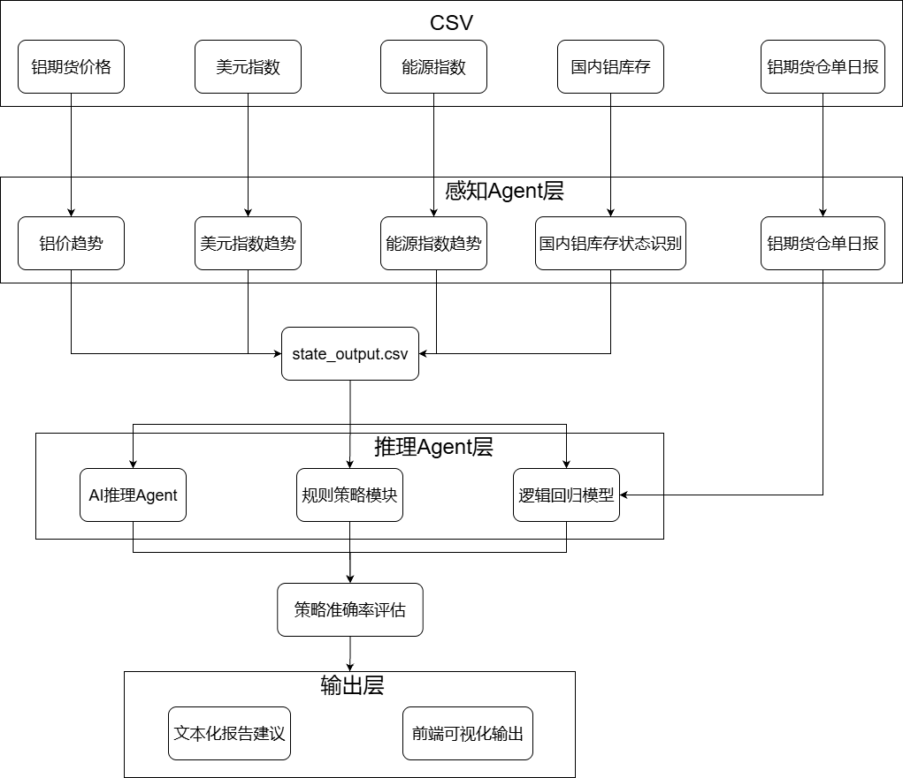

# 铝期货智能决策系统（Azure AI Foundry 实习项目）

## 一、项目背景与目标

在大宗商品交易中，铝作为重要的有色金属，其价格波动受多种因素影响，如美元指数、能源成本、社会库存等。传统的交易决策依赖人工分析和经验判断，效率低且易受主观因素干扰。为提升决策效率与智能化水平，本项目旨在构建一个基于 Azure 平台的“铝期货智能决策系统”。

本系统以“AI Agent”为核心，整合多源数据，通过大语言模型（如 GPT）与规则引擎生成实时交易策略建议，并结合历史数据训练监督模型评估建议的准确性，从而为企业用户提供：

- 实时、多维度的市场状态感知能力；
- GPT驱动的可解释策略建议；
- 基于行为标签的模型反馈与策略验证；
- 全流程在 Azure 平台上可部署、可迭代的智能化决策系统。

本项目为期四周，作为 Microsoft PTA 实习的核心任务之一，重点体现对 Azure AI、数据工程与智能 Agent 设计的综合应用能力。

## 二、系统架构设计
### 2.1 总体架构图

### 2.2 Azure 模块划分与职责
| 模块       | 使用服务               | 功能说明                  |
| -------- | ------------------ | --------------------- |
| 数据存储     | Azure Blob Storage | 存放原始数据、插值数据、仓单日报等     |
| 数据计算     | Azure Notebook     | 执行清洗、状态构造、模型训练        |
| AI Agent | Azure OpenAI API   | GPT-4.1-mini 模型生成策略建议 |
| 策略输出     | CSV 存储 + 可视化       | 输出双通道建议供前端或 BI 使用     |
| 模型训练     | Sklearn + Notebook | 训练监督模型以回测策略命中率        |


## 三、数据集构建与来源
### 3.1 原始数据集（铝价、美元指数、能源价格等）
### 3.1 原始数据集

| 数据集名称 | 来源 | 频率 | 字段说明 | 用途 |
|------------|------|------|----------|------|
| `aluminum_prices.csv` | 雅虎财经（LME铝价） | 日频 | close| 构造铝价状态 |
| `usd_index.csv` | MarketWatch（美元指数） | 日频 |  close | 构造宏观货币状态 |
| `energy_index.csv` | IMF （Primary Commodity Energy Index） | 月频 | energy_index | 构造能源成本状态（插值为日频） |
| `inventory.csv` | macromicro（SHFE） | 周频 | Aluminium_inventory | 用于标签构造和库存状态判断 |
| `futures_inventory.csv` | SHFE | 日频 | inventory_tons，inventory_change  | 用于真实策略标签构造 |

> 所有数据统一存储在 Azure Blob Container 中，通过 Notebook 脚本读取并标准化处理。

### 3.2 仓单日报与行为标签构建

从上海期货交易所公开披露的《指定交割仓库期货仓单日报》中，提取全国“总计”仓单变动量，作为实际市场行为的代理标签：

- `inventory_tons`: 当日全国持仓量（吨）
- `inventory_change`: 与前一日变化量
- `actual_action`: 若 `inventory_change < 0`，则视为行为信号（1），否则为0

该标签用于训练监督模型，也作为对 GPT 建议行为的基准评估依据。

### 3.3 数据预处理与插值策略

- 对于月频或周频数据（如能源价格、库存量），采用线性插值或前向填充方式转换为日频；
- 插值时保留原始采样日标记，以避免重复训练或标签污染；
- 所有数据按时间对齐，并根据日期字段统一合并入 `strategy_suggestions.csv` 中。

最终生成的数据框架支持每日感知特征输入，供 AI Agent 与监督模型共同使用。

## 四、AI Agent 感知与推理

项目中设计了一个具备“多因子感知 + 智能策略生成”能力的 AI Agent，主要由两个子模块构成：

-  GPT 推理 Agent（智能通道）
-  规则策略模块（可解释通道）

通过感知每日市场状态，双通道并行生成交易建议，并统一输出为结构化文件。

### 4.1 状态感知模块

系统定义了四类核心感知状态，用于判断市场当日是否适合采购铝：

| 状态类别       | 来源数据           | 状态值类型     | 示例取值 |
|----------------|--------------------|----------------|----------|
| 铝价状态       | `aluminum_prices.csv` | "rising" / "falling" / "stable" | rising |
| 美元指数状态   | `usd_index.csv`    | 同上           | stable   |
| 能源成本状态   | `energy_index.csv` | 同上           | falling  |
| 库存状态       | `inventory.csv`    | "low" / "medium" / "high" | medium |

状态值通过与历史均值、分位数或滑动窗口进行比较获得，最终组成每日状态组合，如：

```json
{
  "aluminum_status": "rising",
  "usd_status": "stable",
  "energy_status": "falling",
  "inventory_status": "medium"
}
```

### 4.2 GPT 推理 Agent

调用 Azure OpenAI GPT-4.1-mini 模型，输入每日状态组合，输出带解释的采购建议：

* Prompt 内容示例：

```
你是广东铝业的企业采购顾问。根据以下市场状态判断是否采购/延迟/套期保值，并说明理由：
- 铝价状态：rising
- 美元指数状态：stable
- 能源成本状态：falling
- 库存状态：medium
```

* 返回格式：

```
建议：采购
理由：铝价上涨叠加能源成本下行，企业可适时补库……
```
该建议具有自然语言解释能力，便于企业用户理解背后逻辑。

### 4.3 规则策略 Agent

同时构建一套基于专家经验的简单规则逻辑，如：

* 若铝价为 rising 且库存为 low，则建议采购；

* 若库存为 high 或能源价格上涨，则建议延迟采购；

* 若美元指数大幅波动，建议套期保值。

规则建议以 rule_suggestion 字段输出，并与 GPT 建议共同保存在结果文件中。
该模块提升可解释性，也为 GPT 提供基线对比。

## 五、策略建议生成与保存

系统在每日状态感知完成后，立即触发双通道推理模块，生成结构化策略建议，并统一存储于 `strategy_suggestions.csv` 文件中，供前端系统调用或供后续监督学习模块使用。

### 5.1 双通道输出结构

每一条策略建议都对应一个具体的交易日和状态组合，由 GPT Agent 与规则模块分别独立给出建议，输出格式如下：

| 字段名               | 含义描述                         |
|----------------------|----------------------------------|
| date                 | 交易日期                         |
| aluminum_status      | 铝价状态（rising / falling / stable） |
| usd_status           | 美元状态                         |
| energy_status        | 能源状态                         |
| inventory_status     | 库存状态                         |
| gpt_suggestion       | GPT 模型生成的自然语言建议         |
| rule_suggestion      | 基于规则系统生成的文本建议         |

**示例：**

```csv
date,aluminum_status,usd_status,energy_status,inventory_status,gpt_suggestion,rule_suggestion
2025-06-25,stable,stable,stable,medium,建议：延迟采购 理由：市场无明显波动，建议观望,建议：保持观望（理由：信号不明确）
```

### 5.2 strategy_suggestions.csv 格式与字段说明

* 作为前端展示策略建议内容的数据源；

* 与实际行为标签合并后用于监督模型训练；

* 为策略准确率评估（GPT vs Rule vs Model）提供基础；

* 便于分析每日状态与建议对应关系，辅助人工复盘。

该文件通过 Azure Notebook 自动生成与更新，并保存至 Azure Blob 存储或导出为本地 CSV。

策略建议结构清晰，便于未来集成 API 调用、BI 可视化或连接前端策略面板。

## 六、行为标签构建与模型训练

为了验证 GPT 与规则策略建议的有效性，系统构建了一个监督学习模型，通过实际市场行为数据作为标签，评估建议的命中率与可预测性。

### 6.1 库存变化构建行为标签 actual_action

使用上海期货交易所发布的《仓单日报》中全国“总计”数据，提取每日仓单总量与变动量，构造如下字段：

| 字段名             | 含义                         |
|--------------------|------------------------------|
| inventory_tons     | 当日总仓单量（吨）              |
| inventory_change   | 与前一日差值，正值为入库，负值为去库 |
| actual_action      | 若 `inventory_change < 0`，则为 1，代表可能存在采购行为；否则为 0 |

构造逻辑如下：

```python
df_inventory["inventory_change"] = df_inventory["inventory_tons"].diff()
df_inventory["actual_action"] = (df_inventory["inventory_change"] < 0).astype(int)
```

### 6.2 状态特征编码方式

为了输入监督模型，需将感知状态字段编码为数值型特征，映射规则如下：

```python
status_map = {"falling": -1, "stable": 0, "rising": 1}
inv_map = {"low": 0, "medium": 1, "high": 2}
```

对应生成以下字段：

* `aluminum_code`

* `usd_code`

* `energy_code`

* `inventory_code`

这些编码特征作为模型的输入变量 X，与实际行为标签 y 一同用于模型训练。

## 七、策略效果评估

为全面衡量本系统生成的策略建议是否符合真实市场行为，系统从三种策略来源中提取行为意图（是否采购），并与实际标签 `actual_action` 进行准确率对比分析。

### 7.1 GPT 建议 vs 实际行为准确率

从 `gpt_suggestion` 字段中通过关键词匹配提取意图：

```python
def extract_gpt_action(text):
    if pd.isna(text):
        return 0
    if "采购" in text and "延迟" not in text:
        return 1
    elif "套期保值" in text:
        return 1
    return 0
```

### 7.2 规则建议 vs 实际行为准确率

同样提取规则建议的行为信号：

```python
def extract_rule_action(text):
    if pd.isna(text):
        return 0
    if "采购" in text:
        return 1
    return 0
```

与实际行为对比后，分析专家规则的保守性与命中率，作为 GPT 的性能参考基线。

### 7.3 模型预测表现与对比分析

训练的逻辑回归模型会根据每日状态特征输出预测标签 model_action：

```python
df["model_action"] = model.predict(X)
```

最终将三者准确率汇总为表格形式：

| 策略来源   | 准确率  | 备注           |
| ------ | ---- | ------------ |
| GPT建议  | 0.52 | 与真实行为接近随机，缺乏显著优势    |
| 规则建议   | 0.49 | 相对保守，但命中率略低于 GPT     |
| ML模型预测 | 0.59 | 表现优于 GPT 与规则，具有一定模式识别能力 |


## 八、存在问题与优化方向

在本次实习项目的实现过程中，系统完成了从多因子感知到策略输出与回测评估的完整闭环，但在实验与分析过程中也暴露出若干关键问题，有待后续优化提升：

### 8.1 行为标签与策略意图不完全一致

当前 `actual_action` 标签基于仓单库存变动构造，仅能反映去库存行为（如交割、出库、实物采购），而 GPT 的建议中同时包含了“采购”与“套期保值”两类策略意图。

 **问题：**
- 套期保值行为未必引起库存变动，易造成策略评价失真；
- 将两类行为统一映射为 `1` 可能稀释评估准确性。

 **优化方向：**
- 构建三类标签：不操作 / 套期保值 / 实体采购；
- 或为 GPT 建议添加 `strategy_type` 字段用于意图拆分。

### 8.2 状态感知区间静态，难适配长期波动

库存状态采用全局分位数划分（如 low / medium / high），但在五年期样本中库存区间显著波动，可能造成感知误判。

 **问题：**
- 同一数值在2020年可能为 high，在2024年可能为 low；
- 固定阈值无法适配长期趋势漂移。

 **优化方向：**
- 引入滑动窗口分位数进行“动态状态划分”；
- 构建“变化趋势特征”替代绝对状态，如库存连续下跌天数。

### 8.3 模型反馈机制未形成闭环

当前模型用于策略验证，但未将其反馈用于“修正 Agent 提示”或优化下轮策略。

 **优化方向：**
- 构建策略评分系统，将命中率作为信号返回给 Agent；
- 引入强化学习机制，探索“策略 - 行为 - 反馈”的持续优化路径。

### 8.4 缺乏价格后验回测与收益分析

目前评估集中于是否发生采购行为，尚未结合铝价后续走势进行实际收益回测。

 **优化方向：**
- 为每个建议日记录后续 3/5/10 日价格走势；
- 评估 GPT 建议“采购”后是否价格上涨，实现“智能 + 盈利性”双重验证。

### 8.5 缺乏真实策略数据作为评价参考

当前系统仅依赖仓单变动构造标签，未能引入机构（如投行、大型贸易商）公开的策略建议作为 benchmark。

 **问题：**
- 缺少“人类专家策略”做对照，无法判断 GPT 策略是否优于常规行为；
- 评价标准单一，策略有效性判断不够全面。

 **优化方向：**
- 引入市场研报、机构持仓变化、COT报告等行为作为标签；
- 收集历史推荐报告作为“软标签”或验证依据。

### 8.6 缺乏舆情/新闻等宏观变量作为感知因子

目前仅使用价格与库存数据构造市场状态，未能引入如政策、产能扰动、战争等宏观影响。

 **问题：**
- 无法识别突发性新闻或事件驱动行情；
- GPT 对上下文缺失，容易产生误导建议。

 **优化方向：**
- 引入金融新闻摘要（如路透、彭博）或情感指数；
- 构建大模型辅助的“舆情状态因子”，丰富感知输入。

---

> 本项目为短周期实习任务，已搭建完整系统原型；若在后续迭代中引入真实专家策略、价格后验回测与宏观因子建模，将显著提升智能系统的判断力与可信度。

## 九、总结与实习收获

## 九、总结与实习收获

在本次为期一周的 Microsoft PTA 实习项目中，我围绕“铝期货智能决策系统”的构建任务，完成了从系统架构设计、数据接入处理、AI Agent 推理、行为标签构造、监督模型训练到策略效果评估的全流程，实现了一个具备实时策略建议与历史行为验证能力的可运行原型系统。

通过本项目，我实现了以下几个方面的实质性成长与积累：

### 技术能力提升

- 熟悉了 Azure 平台在 AI 项目中的典型应用流程，包括：Blob 存储、Notebook 开发、OpenAI GPT 推理调用等；
- 熟练掌握数据处理流程，如跨频率数据对齐、缺失值插值、滑窗状态构造等；
- 实战训练了模型评估与对比分析能力，能通过准确率、召回率等指标客观判断模型性能；

### AI Agent 实践经验

- 通过构建双通道 Agent（GPT + 规则），实现了智能性与可解释性的平衡；
- 学会了如何基于自然语言策略建议提取结构化行为信号；
- 探索了 Agent 与模型反馈联动机制，为未来策略自进化系统打下基础。

### 策略建模与市场理解

- 对影响大宗商品价格的多维度因素（如美元指数、能源价格、库存水平）有了更加系统的理解；
- 认识到策略建议评价中标签设计的重要性，尤其是“行为标签 vs 策略意图”的一致性问题；
- 意识到真实业务中需引入专家策略、舆情信号等外部信息，避免“数据闭环”带来的误导。

---

总体而言，本次实习让我完整经历了一个 AI 驱动的智能决策系统从设计、实现到评估的全过程。系统虽仍有待提升，但我对 AI 在产业决策中的潜力有了更深刻的理解，也提升了自己跨学科综合建模的能力。

> 未来若能引入专家行为数据、后验价格走势、宏观舆情信息作为补充，我相信该系统具备成为工业级“策略推荐+风险分析平台”的潜力。
